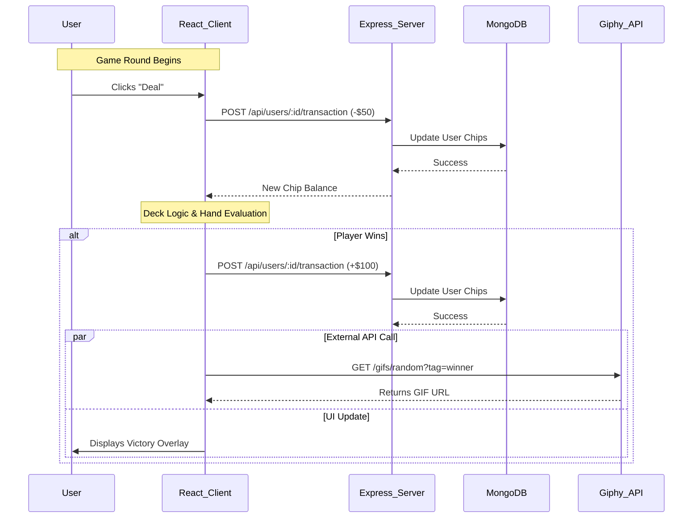

# True Poker ♠️

A full-stack, real-time Poker application built with React, Express, and MongoDB. This project demonstrates a secure, interactive, and deployed web application featuring Google OAuth, complex game logic, and external API integration.

## 🔗 Project Links (Rubric Requirements)
* **Live Application:** https://true-poker.uk.r.appspot.com
* **Video Demonstration:** https://youtu.be/drpBs6iBfLU
* **GitHub Repository:** https://github.com/creed4UAlbany/true-poker.git

---

## 🛠️ Setup & Installation

To run this project locally, follow these steps:

### 1. Clone and Install
```bash
# Clone the repository
git clone [https://github.com/creed4UAlbany/true-poker.git](https://github.com/creed4UAlbany/true-poker.git)

# Install Client Dependencies
cd client
npm install

# Install Server Dependencies
cd ../server
npm install
```

### 2. Environment Variables
You must create **two** `.env` files to run the application locally.

**A. Server Variables**
Create a `.env` file in the `server/` directory:
```env
MONGO_URI=your_mongodb_connection_string
PORT=3000
```

**B. Client Variables (Firebase)**
Create a `.env` file in the `client/` directory:
```env
VITE_FIREBASE_API_KEY=your_firebase_api_key
VITE_FIREBASE_AUTH_DOMAIN=your_project_id.firebaseapp.com
VITE_FIREBASE_PROJECT_ID=your_project_id
VITE_FIREBASE_STORAGE_BUCKET=your_project_id.appspot.com
VITE_FIREBASE_MESSAGING_SENDER_ID=your_sender_id
VITE_FIREBASE_APP_ID=your_app_id
```

### 3. Run the Application
You need two terminals open:
```bash
# Terminal 1: Start Backend (Port 3000)
cd server
npm run dev

# Terminal 2: Start Frontend (Port 5173)
cd client
npm run dev
```

---

## 🧪 Automated Testing (Rubric 3.2)
This project uses **Playwright** for End-to-End (E2E) testing. The test verifies that the application bundles correctly, the home page loads, and the "Sign in with Google" entry point is accessible.

**To run the test:**
```bash
# Ensure the development server is running first!
npx playwright test
```

---

## 🏗️ Architecture & Design Pattern (Rubric 3.5)

**Design Pattern:** Client-Server Architecture (REST API)
The application follows a standard **Client-Server** pattern where the React frontend (Client) handles the UI and game state presentation, while the Express backend (Server) manages persistent data and business logic validation.

**Sequence Diagram:**
The following diagram illustrates the data flow during a game round, specifically showing how the Client orchestrates communication between the internal Backend (for chips) and the external API (for celebrations).



---

## 📚 Credits & Attribution (Rubric 3.4)

This project was built using the following open-source libraries and external resources:

* **Game Logic:**
    * [`pokersolver`](https://www.npmjs.com/package/pokersolver) - Used for evaluating poker hand rankings (Two Pair, Flush, etc.).
* **UI & Animation:**
    * [`framer-motion`](https://www.framer.com/motion/) - Used for the 3D card flip animations and layout transitions.
* **Data Fetching:**
    * [`swr`](https://swr.vercel.app/) - Used for real-time state synchronization with the backend (Rubric 1.3).
    * [`axios`](https://axios-http.com/) - Used for HTTP requests.
* **External APIs:**
    * **Giphy API** - Used to fetch victory/defeat GIFs dynamically (Rubric 1.4).
    * **Google OAuth (Firebase)** - Used for secure user authentication and avatar retrieval (Rubric 1.2).
* **Testing:**
    * **Playwright** - Used for End-to-End automated testing.